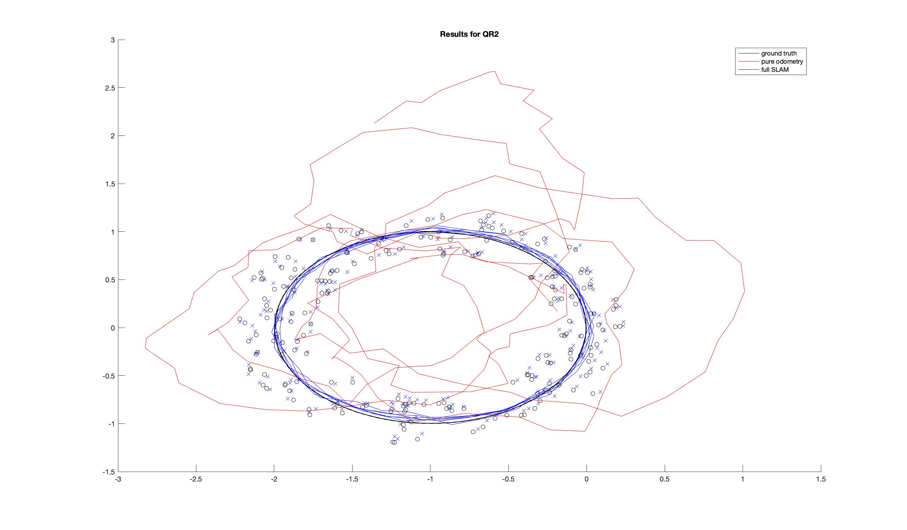
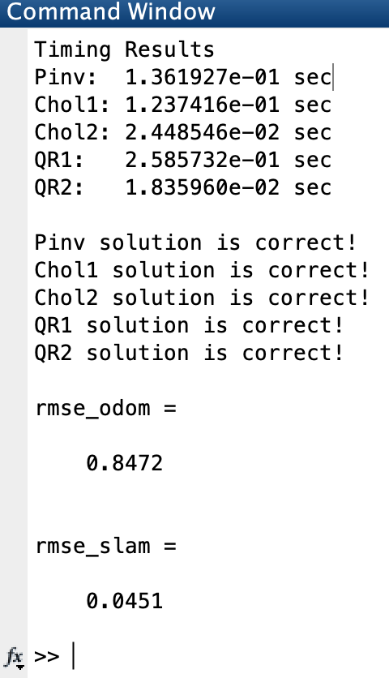
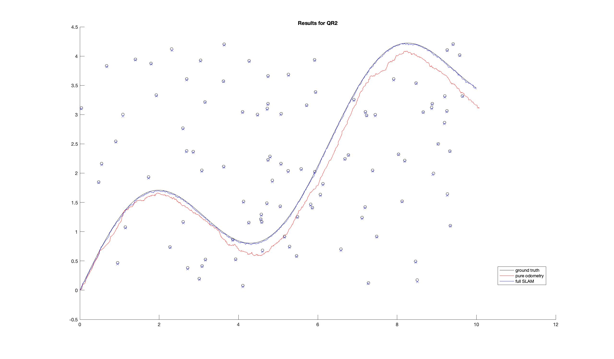
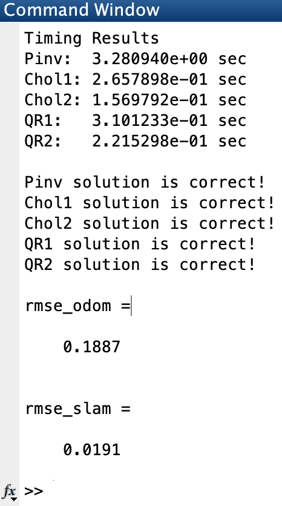
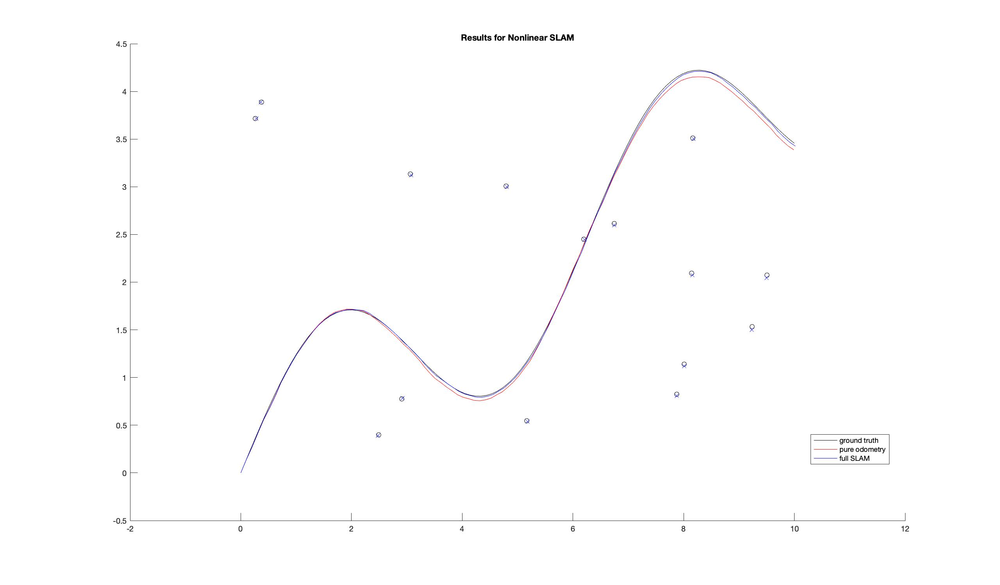
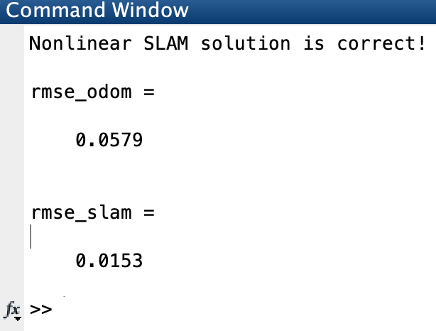

# Linear & Nonlinear Optimization Based SLAM

-----------------------

Linear SLAM results on loop dataset

-----------------------

Linear SLAM results on regular dataset

-----------------------

Nonlinear SLAM results on regular dataset

-----------------------